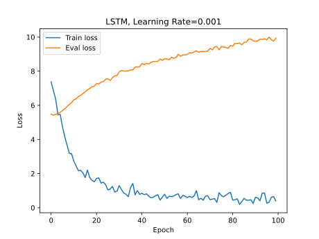
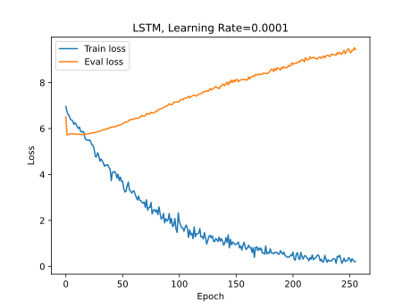

# RNN 语言模型

## 任务内容

- 使用 RNN 实现一个简易的语言模型
- 使用给定的语料库（[train_en.txt](https://github.com/djz233/DCS2021/blob/main/train_en.txt)、[eval_en.txt](https://github.com/djz233/DCS2021/blob/main/eval_en.txt)）进行训练
- 记录模型损失
- 预测测试集（[test_en.txt](https://github.com/djz233/DCS2021/blob/main/test_en.txt)）中每个句子的下一个单词的概率分布

## 实现简介

### 分词

由于是英文语言模型，分词手段以空格分割为主。最开始是自己用正则表达式实现的分词，同时将大部分标点符号进行去除：

```python
import re
# 用于去除标点的正则
PUNC = r'[.!?/_,$%^*()+"\'-+~@#%&]'
SEP = re.compile(PUNC + r'*\s+')
PREFIX = re.compile('^' + PUNC + '+')
# 数据集中有些 <br />，替换为空格
# 先用标点+空格分割，然后去除前缀标点，转为小写
line = [PREFIX.sub('', word).lower() for word
        in SEP.split(line.replace('<br />', ' '))
        if len(PREFIX.sub('', word))]
```

后来发现去除标点可能会导致句子中部分信息丢失，遂改用 [`torchtext.data.utils.get_tokenizer`](https://pytorch.org/text/stable/data_utils.html) 进行分词：

```python
from torchtext.data import get_tokenizer
torchtext_tokenizer = get_tokenizer("basic_english")
line = torchtext_tokenizer(line.replace('<br />', ' ').strip())
```

### 建立词表

将分词结果导入 [`set`](https://docs.python.org/zh-cn/3/library/stdtypes.html#set-types-set-frozenset) 中，然后使用 [`enumerate`](https://docs.python.org/zh-cn/3/library/functions.html#enumerate) 简单地建立 word-id 的双射关系，0 号保留为占位符 `<pad>`，然后再在末尾附加未登录词标记 `<unk>`：

```python
word2id = {'<pad>': 0}
id2word = {0: '<pad>'}

for i, word in enumerate(list(words)):
    word2id[word] = i+1
    id2word[i+1] = word

word2id['<unk>'] = len(word2id)
id2word[len(id2word)] = '<unk>'
```

随后将词表保存为文件，以便后续使用。这里使用了 [`json`](https://docs.python.org/zh-cn/3/library/json.html) 进行存储。

### 模型实现

选择 [`torch.nn.RNN`](https://pytorch.org/docs/stable/generated/torch.nn.RNN.html)、[`torch.nn.LSTM`](https://pytorch.org/docs/stable/generated/torch.nn.LSTM.html)、[`torch.nn.GRU`](https://pytorch.org/docs/stable/generated/torch.nn.GRU.html) 中的一个作为基本的循环神经网络，然后根据实际情况的输入输出数据。主要有以下 4 层：

- 词嵌入层（输入、编码）：将输入的词语 id 序列逐个转换为张量。使用 [`torch.nn.Embedding`](https://pytorch.org/docs/stable/generated/torch.nn.Embedding.html) 实现。
- 循环神经网络层：上面提到的 3 个 PyTorch 神经网络之一，输入当前时刻的隐状态和输入数据，得到下一时刻的隐状态和输出数据。LSTM 网络会有一个额外的“细胞状态”。
- Dropout 层：抑制神经网络过拟合。使用 [`torch.nn.Dropout`](https://pytorch.org/docs/stable/generated/torch.nn.Dropout.html) 实现。
- 线性层（输出、解码）：用一个线性层将神经网络输出转换回词语 id 的形式，即输入的形式。使用 [`torch.nn.Linear`](https://pytorch.org/docs/stable/generated/torch.nn.Linear.html) 实现。实际上，该层的输出结果不直接为词语 id，而是词表中每个词语在词语序列（句子）每个位置上出现的可能性大小。

对应的前向传播函数实现如下：

```python
def forward(self, inputs, hidden):
    emb = self.drop(self.encoder(inputs))
    output, hidden = self.rnn(emb)
    output = self.drop(output)
    decoded = self.decoder(output)

    return decoded, hidden
```

### 训练和评估

给定的数据集由许多行文本组成，在前面已经完成了数据的分词。为了便于数据读取，可以继承 [`torch.utils.data.Dataset`](https://pytorch.org/docs/stable/data.html#torch.utils.data.Dataset) 对分词后的数据集进行包装，同时提供工具函数 `get_words_by_ids` 和 `get_ids_by_words` 。该数据集可以被 [`torch.utils.data.DataLoader`](https://pytorch.org/docs/stable/data.html#torch.utils.data.DataLoader) 使用，将多数据组装成一个 batch 输入神经网络进行训练。但是组装 batch 要求每组数据的长度一致，直接给句子末尾填充大量占位符 0（`<pad>`）会影响训练效果，且该任务给定的数据集大小不大，即使不将数据组装为 batch 输入（即 `batch_size` 为 1），在作者的实验环境也只需约 1 分钟即可完成 100 次 epoch，故在最终的实现中没有添加对 batch 的支持。

使用标准类型处理好数据集后，就可以将数据输入神经网络进行训练了。针对每个输入的数据（`data`），主要有以下步骤：

1. 调用模型的 `zero_grad` 方法清空梯度信息，否则梯度信息会不准确。
2. 将输入数据和当前隐状态输入模型，得到输出和下一时刻的隐状态。
3. 使用损失函数 [`torch.nn.CrossEntropyLoss`](https://pytorch.org/docs/stable/generated/torch.nn.CrossEntropyLoss.html#torch.nn.CrossEntropyLoss) 计算损失。
4. 利用损失函数的计算结果进行梯度回传。
5. 进行梯度裁剪，解决“梯度爆炸”问题。
6. 使用优化器 [`torch.optim.Adam`](https://pytorch.org/docs/stable/generated/torch.optim.Adam.html) 更新模型参数，实现梯度下降。

```python
for i, batch in enumerate(dl_train):
    data, target = batch

    # 使用gpu训练需要将数据也迁移到gpu
    if CONFIG['useCUDA']:
        data, target = data.cuda(), target.cuda()

    hidden = M.repackage_hidden(hidden)
    model.zero_grad()
    output, hidden = model(data, hidden)
    loss = LOSS_FN(output.view(-1, VOCAB_SIZE), target.view(-1))
    loss.backward()
    nn.utils.clip_grad_norm_(model.parameters(), CONFIG['gradClip'])
    optimizer.step()
```

若要对模型进行评估，可以调用模型的 `eval` 方法，使模型进入评估状态。与训练时类似，将评估数据逐个输入模型，得到输出和对应的损失。对这些损失计算平均值，即可表示本次评估的结果。为了提高性能，还可以暂时关闭 PyTorch 的自动求导功能，加速模型计算。评估结束后，调用模型的 `train` 方法返回训练状态。在训练的过程中选择适当的时机进行评估，同时将评估结果损失最小的模型进行保存，理论上就可以获得训练得到的最好的模型。

### 预测

预测与评估类似，但是最后需要将隐状态转换回人类可读的字词。这里可以调用在模型中自定义的 `decoder` 方法（也就是“模型实现”部分中的“线性层”），将模型的隐状态转换为词表中各个词语的分数，然后打印出最高分的 5 个词语作为参考结果。

```python
for i, batch in enumerate(dl_test):
    hidden = model.init_hidden(requires_grad=False)
    data, target = batch
    if CONFIG['useCUDA']:
        data, target = data.cuda(), target.cuda()

    hidden = M.repackage_hidden(hidden)

    with torch.no_grad():
        output, hidden = model(data, hidden)
    if model.rnn_type == "LSTM":
        # LSTM 输出 output, (h_n, c_n)
        # h_n 保存着 RNN 最后一个时间步的隐状态。
        # c_n 保存着 RNN 最后一个时间步的细胞状态。
        hidden = hidden[0]

    # 将隐藏层转换为词表中每个词的分数
    decoded = model.decoder(hidden.view(hidden.size(2)))
    result = {}
    for i, score in enumerate(decoded):
        result[id2word[i]] = float(score)

    # 打印输入和分数最高的前 5 个词
    print('=' * 16)
    print('input = "' + ds_test.get_words_by_ids([int(i)
            for i in list(batch[0][0])]) + '"')
    print('output =', dict(sorted(result.items(), key=lambda s: -s[1])[:5]))
```

## 实验环境

- x86_64 GNU/Linux Ubuntu
- Python 3.8.15
  ```
  numpy
  torch==1.13.0
  torchtext==0.14.0
  tqdm
  ```

## 实验结果

可能由于给定预料库内容的特性，验证集（`eval_en.txt`）的损失在训练过程中持续呈现上升趋势，但训练损失是收敛的，故验证集不具有参考价值，只能依靠人工观察选择较好的模型。经过反复实验，作者发现选用 `LSTM` 模型，学习率设置为 `0.001`，最大 epoch 数设为 `100` 时训练出来的效果较好。

以下为使用上述参数进行训练的一次结果，该模型的 checkpoints 在作业附件中有附。

模型在测试集（`test_en.txt`）上的预测结果：

```
input = "i don ' t know <unk> i like this"
output = {
    'film': 9.407007217407227,
    'one': 8.234719276428223,
    'movie': 8.157305717468262,
    'it': 7.446529865264893,
    'was': 6.249240398406982
}
```

```
input = "i don ' t know <unk> i like this movie so"
output = {
    'much': 8.265496253967285,
    'the': 6.367043495178223,
    'everyone': 6.332866191864014,
    'recommend': 6.048136234283447,
    'true': 6.012755393981934
}
```

```
input = "this is a good film . this is very"
output = {
    'good': 13.875051498413086
    'great': 12.208250045776367
    'bad': 10.481400489807129
    'the': 9.862262725830078
    'believable': 7.582455158233643
}
```

观察以上三组输出，我们不难发现该次训练出的模型在测试集上的表现良好。

损失随着模型迭代变化的图像：



综上所述，虽然该模型在验证集上的损失较高，但观察到其在测试集上的表现不差，故本次实验基本达成任务目标，实现了一个简易的 RNN 语言模型。

## 实验思考

### 循环神经网络的类型

普通 RNN 在利用梯度下降算法链式求导时是连乘的形式，容易导致“梯度消失”或“梯度爆炸”，由此出现了 LSTM，LSTM 链式求导时是相加的形式。LSTM 使用遗忘门、输入门、输出门选择性地忘记一些不重要的信息，GRU 的原理与 LSTM 相似，但只有两个门（重置门与更新门）。

### 数据集 batch

经实验，将多组数据组装为 batch 一次性输入神经网络进行训练可以大幅提高模型效率，但是同一 batch 内的序列（句子）长度必须一致，直接使用 0 填充使序列等长会影响模型的学习效果。作者暂时没有好的解决方案，故本次实验中没有实现数据集的批量输入。

### 未登录词

针对训练中没有出现过的词语，本次实验将他们统一为一个特殊的标记 `<unk>`，但这个标记在训练过程中并没有被针对训练，可能会降低模型的迁移能力。

### 模型在验证集上的异常表现

在本次实验中用于评估模型效果的验证集在模型上的损失始终保持高位，作者进行了部分探究：

首先排查评估函数损失计算部分的问题。直接将验证集设定为训练集，结果评估损失随训练损失同步下降，证明评估函数没有问题。

随后尝试增加迭代次数。结果模型不仅在验证集上的损失没有下降，同时在训练集和测试集的表现也变差了。

最后尝试减小学习率的数量级。如下图所示，尽管减小了学习率，但是模型在验证集上的损失还是在初始的高位稳定一段时间后开始上升，没有明显达到更小的值。并且，人工观察验证集损失最小时的模型表现，发现其与未训练的模型差异不大。



## 实验心得

通过完成本次实验，作者第一次将学习到的机器学习理论知识应用到了实践中，学习了使用 PyTorch 框架辅助实现神经网络与机器学习的方法。同时，本次实验还使作者深化了对自然语言处理相关概念的理解，巩固了课程所学知识。但实验的模型还有较大缺陷，算是本次实验的遗憾。总之，本次实验对于机器学习和自然语言处理的学习都有很大的帮助。
